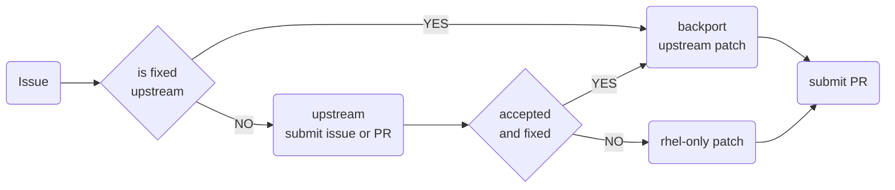

# Contributing

Welcome to systemd source-git for CentOS Stream and RHEL. When contributing, please follow the guide below.

## Workflow



## Filing issues

When you find an issue with systemd used in CentOS Stream or RHEL, please file an issue in [Jira ticket system](https://issues.redhat.com/secure/CreateIssue!default.jspa) (set Project to **RHEL** and Component to **systemd**).

GitHub Issues are not supported tracking system. If your issue is reproducible using the latest upstream version of systemd, please consider creating [upstream issue](https://github.com/systemd/systemd/issues/new/choose).

## Posting Pull Requests

Every Pull Request has to comply with the following rules:

- Each commit has to reference [upstream](https://github.com/systemd/systemd) commit.
- Each commit has to reference the approved issue/tracker.
- Pull requests have to pass mandatory CI validation and testing
- Pull requests have to be approved by at least one systemd downstream maintainer

### Upstream reference

When doing a back-port of an upstream commit, always use `cherry-pick -x <sha>`. Consider proposing a change upstream first when an upstream commit doesn't exist.
If the change isn't upstream relevant or accepted by upstream, mark the commit with the `rhel-only` string.

```md
doc: Fix TYPO

rhel-only

Resolves: RHEL-678
```

### Issue reference

Each commit has to reference the relevant approved systemd issue (see: [Filling issues section](#filing-issues)). For referencing issues, we use the following keywords:

- **Resolves** for commits that directly resolve issues described in a referenced tracker
- **Related** for commits related to the referenced issue, but they don't fix it. Usually, tests and documentation.
- **Reverts** for commits that reverts previously merged commit

When referencing issues, use following structure: `<keyword>: <issue ID>`. See the example below:

```md
doc: Fix TYPO

(cherry picked from commit c5afbac31bb33e7b1f4d59b253425af991a630a4)

Resolves: RHEL-678
```

### Validation and testing

Each Pull Request has to pass all enabled tests that are automatically run using GitHub Actions, CentOS Stream CI, and others.
If CI failure is unrelated to the change introduced in Pull Request, the downstream maintainer will set the `ci-waived` label and explain why CI was waived.
